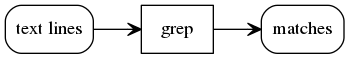
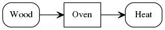

# Dreitafel
**Heads up, this is still very much in development (2017-Aug-06)**, the compiler works for veeeeery simple diagrams, but that's it. See you in a month for something useful. :)

Dreitafel helps you document and discuss the architecture and design of your software.

At its core, Dreitafel is a modeling language plus some tools, such as a compiler.


For example, this is how you could model `grep`:

```
(textLines) -> [grep] -> (matches)
```

Dreitafel turns this text-based diagram into an image:




## Trying it

You need Docker installed for the simple version to work.

Check out the repository and convert a text diagram to PNG:

```
./try.sh "(Wood) -> [Oven] -> (Heat)" cozy.png
```

Or, manually:

```
make dreitafel

echo '(Wood) -> [Oven] -> (Heat)' | ./dreitafel | dot -Tpng > cozy.png
```

Even more alpha is the webcompiler. Run it with this command:

```
make dreitafel-web && ./dreitafel-web
```

and then visit [this url](http://localhost:8080/fmc/?format=svg&diagram=(staticFiles)%20-%3E%20[NGINX]%20----%3E%20(logFiles)) to see the SVG for `(staticFiles) -> [NGINX] ----> (logFiles)`

## Why Dreitafel?

To my mind, one of the major contributions to documentation in open-source projects
was GitHub's READMEs. Many projects are documented purely in this single file,
relying on the browser search for nagivation. And it works.

It works, because those Markdown files are *simple* and *easy to change*.

Modeling software using diagrams should be simple and easy to change, too.
To do that, Dreitafel relies an existing modeling language,
namely the Block Diagrams of the [Fundamental Modeling Concepts (FMC)](http://fmc-modeling.org/).

FMC is not restricted to software, though.
It really is about *modeling systems*.
Have a look at this example of how we could model an oven:

 ```
(Wood) -> [Oven] -> (Heat)
 ```

What FMC *is* made for is communication.

It's meant for you and me to talk about how an oven works.
Or a compiler.
Or a database system.
Or a cloud deployment.

Wait, what do we need Dreitafel for again?
To make things look beautiful:



The technology accessible to most people is text.
Dreitafel defines a text-based version of FMC Block Diagrams.

Additionally, Dreitafel comprise of the following tools…

- [x] a **compiler** from a text DSL to graphviz dot.
- [ ] a **web-version of the compiler** so you can send text and get back an image
- [ ] a **viewer of GitHub hosted Dreitafel source code**: You put your diagram source in a textfile on GitHub,
      and in your README link an image to the viewer. Whenever you change the textfile, the image will automatically
      by updated.
- [ ] a **paste-bin and playground** for diagrams
- [ ] a **viewer of Markdown documents**. These may include Dreitafel source code, which is then replaced by images

Eventually, it would be great to get Jekyll and Sphinx support. The viewers would then be somewhat superfluous.

## The Current Architecture of Dreitafel

In its first stage, Dreitafel is a compiler from FMC source code to graphviz' dot.
The latter is then used to generate the actual image.

The following diagram illustrates this (generated with Dreitafel and graphviz of course):


## The (Planned) Architecture of Dreitafel

Dreitafel will consist of three main components:

```
[ Playground webapp ]      -o- [          ]
                               [ Compiler ]
[                        ] -o- [          ]
[ Markdown-viewer webapp ]
[                        ] -o- [ GitHub ]
```

* Compiler: Reads the text source for a diagram and produces the same block diagram nicely rendered as PNG or SVG.
* Playground webapp: Gist/JS-Fiddle clone to play with and link diagrams
* Markdown-viewer webapp: Reads diagram sources, or GH-flavored Markdown from the web
  and renders them as PNG/SVG or HTML, respectively. This will allow you to read a README.md from
  GitHub with beautiful graphs!


### The compiler

The compiler reads Dreitafel source code
and spits out dot-generated graphs of the same FMC Block diagrams.
It consists of the following components:

```dreitafel:fmcblock
[ Reader ] -o- [ Lexer ] -o- [ Parser ] -o- [ DotGenerator ]

[ ErrorHandler ]
```

Each of these components is running as its own goroutine;
communication between them happens with channels.

First, the [Lexer](lexer.go) reads the source code of the diagram.
Its job is to recognize individual diagram elements, such as Actors and Storages.

Any syntax element it recognizes, i.e. `AST Element` from Abstract Syntax Tree, is put into a queue (a Go channel) to be read by the Parser.

```dreitafel:fmcblock
( Source ) -> [ Lexer ] -> ( AstElement ) -> [ Parser ]
                        -> ( Unrecognizable text ) -> [ ErrorHandler ]
```

Anything the Lexer cannot recognize results in an error.
The rest of the line will be skipped and forwarded to the ErrorHandler.

Then, the **Parser** reads the diagram elements recognized by the Lexer.
It's job is to assemble a valid diagram from the individual parts.

```dreitafel:fmcblock
( AST element ) -> [ Parser ] -> ( Diagram )              -> [ Dot Generator ]
                              -> ( Invalid AST Elements ) -> [ ErrorHandler ]
```

The diagram is then forwarded to the Dot Generator.
The AST Elemeents that did not make sense,
i.e. that could not be used to make a valid diagram,
are ignored and forwarded to the error handler.

Example of errors:

* An actor reads from an actor (FMC block diagrams are bipartite graph)
* A channel is dangling, i.e. not connected to anything.

The **Dot Generator** takes the valid FMC block diagram model,
and produces a dot graph representing the FMC diagram.


## The road ahead

## Next technical steps

To remember where I left off:

* server.compileFmcBlockDiagramFromQueryString():
  * [ ] error handling. of course.
    * [ ] handle dot-command not being there
  * [ ] cache headers: 1 day
  * [ ] debug view with fmc source, dot source, output and compile errors at `/debug`
* server.index(): proper index page

### Roadmap

* Minimal deployment
  * [X] Diagram elements
    * [X] Actor
    * [X] Storage
    * [X] Actor reads to Storage
    * [X] Actor writes to Storage.
  * [X] Compiler for Dreitafel text-syntax to graphviz' dot.
  * [x] web-version of the compiler
  * [ ] viewer for GH-hosted Dreitafel source files
  * [ ] Deploy view.dreitafel.org/fmc-blocks/
  * [ ] Deploy try.dreitafel.org
* Publish
  * Add diagram elements and statements.
    * [ ] modifying access
    * [ ] unidirectional channel
    * [ ] bidirectional channel
  * [ ] Compiler GH-flavored markdown with FMC block diagrams to HTML.
  * [ ] Deploy www.dreitafel.org
  * [ ] Deploy view.dreitafel.org/md/
  * [ ] Webapp live-rendering this README.
  * [ ] Create FMC syntax guide, as documentation, and eat-your-own-dogfood.
  * [ ] Logo! (Of course)
* 1.0
  * [ ] CLI <3 — i/o with files/stdin/stdout, proper config
  * [ ] Styling of the diagram, making it look more hand-drawn
  * [ ] Beautiful titles, with spaces, all kinds of characters.
  * [ ] Syntax: Comments
  * [ ] Create badge. :)
  * [x] Build & deploy gist/jsfiddle/play equivalent.
  * [ ] Human Actor
  * [ ] Support for IDs to centralize common attributes when an element re-occurs
  * [ ] multi-line elements
  * [ ] structure variance
* The real deal
  * [ ] 2d connections (vertical, diagonal and freeflowing)
  * [ ] U-formed actor
  * [ ] Nest elements inside an actor or storage to group them.
* Proofs of concept:
  * [ ] Model a physical machine
  * [ ] Document the engageSPARK software architecture.
  * [ ] Document an existing open-source project. (maybe gunicorn or sanic?)
* Possible features
  * Drawing styles: whiteboard, formal, chalk, business-flashy
  * Links: Within diagram, within page, external  - org syntax?
  * Emacs mode <3
  * Comments: Using GH issues?
  * Changes: Using GH PRs?
  * Composability: include diagrams
  * Layout hints
  * Zooming: Step “into” an element to view its details.
  * Printable version
  * More than block diagrams, maybe simple flow diagrams, too.

## Commands to remember:


```
# Convert dot to a PNG:
dot -Tpng simple.dot > simple.png
# Convert dot to a SVG:
dot -Tsvg simple.dot > simple.svg
```
